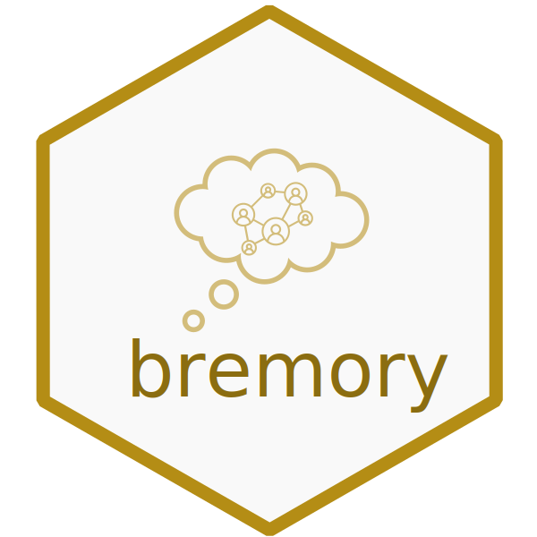

# bremory  

[](https://www.repostatus.org/#active)
[](https://www.github.com/TilburgNetworkGroup/bremory)

#### _The package is currently being upgraded, its full functionalities will be available in the coming weeks - May, 2023_

---

## Modeling Memory Retention in Relational Event Data
The `bremory` package offers several methods for inquiring about the presence of memory in relational event networks:
 * a bayesian semi-parametric approach for modeling memory decay (Arena et al. 2022)
 * a parametric approach for modeling memory decay in one-type relational event networks (Arena et al. 2023)
 * a parametric approach for modeling type-related memory decays (_method not yet published_)
 
	
## Installation
Install the package in R using `devtools` or `remotes`:

```
# via `devtools`
devtools::install_github(repo = "TilburgNetworkGroup/bremory", build_vignettes = TRUE)

# via `remotes`
remotes::install_github(repo = "TilburgNetworkGroup/bremory", build_vignettes = TRUE)
```

## Vignettes

List all the vignettes available with the installed version of `bremory`
```
vignette(package = "bremory") 
```

## Author
Giuseppe Arena, Tilburg University (Tilburg, The Netherlands). (g.arena@tilburguniversity.edu)

## Funding
The funder of this work is the ERC and the ERC project number is 758791.

---

## References

Arena, G., Mulder, J., & Leenders, R. Th. A. J. (2022). _A Bayesian Semi-Parametric Approach for Modeling Memory Decay in Dynamic Social Networks_. Sociological Methods & Research, 0(0). https://doi.org/10.1177/00491241221113875

Arena, G., Mulder, J., & Leenders, R. (2023). _How fast do we forget our past social interactions? Understanding memory retention with parametric decays in relational event models_. Network Science, 1-28. [doi:10.1017/nws.2023.5](https://doi.org/10.1017/nws.2023.5)